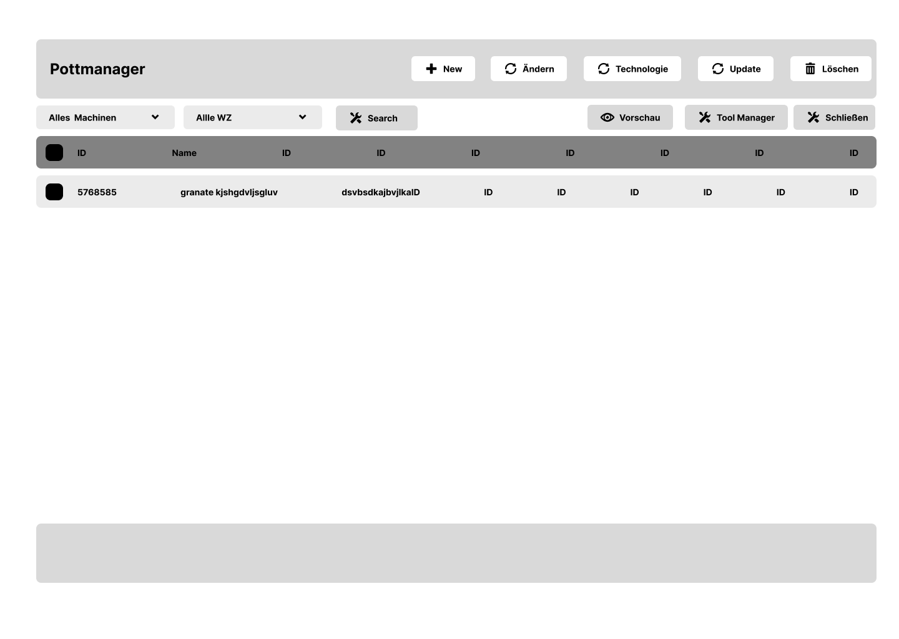
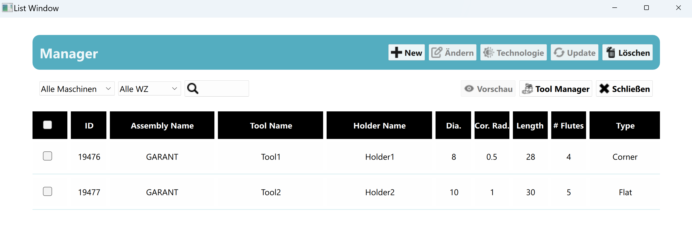

# List Window - QT Creator & QML Project

## Overview
This project is a simple list window created using QT Creator with QML. The main objective was to gain a hands-on understanding of QT Creator and the QML language for designing creative and interactive frontends. The idea was inspired by the list view commonly seen in applications like Google Mail.

This project demonstrates the implementation of a list window that displays various elements in a user-friendly format, making it easy to navigate and responsive to different window sizes.

## Learnings and Implementations

Throughout the process, I learned and implemented the following:

### Basic Syntax & Execution
Understanding QML syntax and learning how to build simple applications.

### Components Used:
Rectangle: For defining shapes and creating layout areas.
Button: For user interaction.
ComboBox: For dropdown menu functionality.
Text & TextInput: For displaying text and accepting user inputs.

### Layouts:
RowLayout: Organizing items horizontally.
ColumnLayout: Organizing items vertically.
GridLayout: Arranging items in a grid pattern.

### Dynamic Elements:
Repeater: For dynamically generating list items.
TableView & TableViewColumn: To display tabular data efficiently.

### Scrolling & Responsiveness:
Flickable & ScrollView: To allow users to scroll through large lists.
Responsive Design: Making sure that all elements scale and adjust according to window size.

## Initial Figma design

## Final UI Output

## Conclusion
This project helped solidify my understanding of QT Creator and QML. I successfully created a responsive and interactive list window that mimics the design structure seen in real-world applications like Google Mail.

